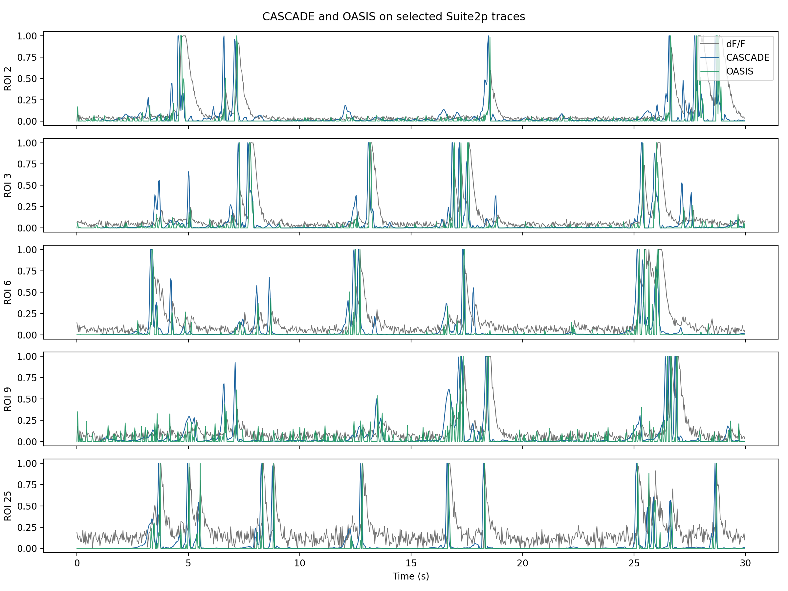
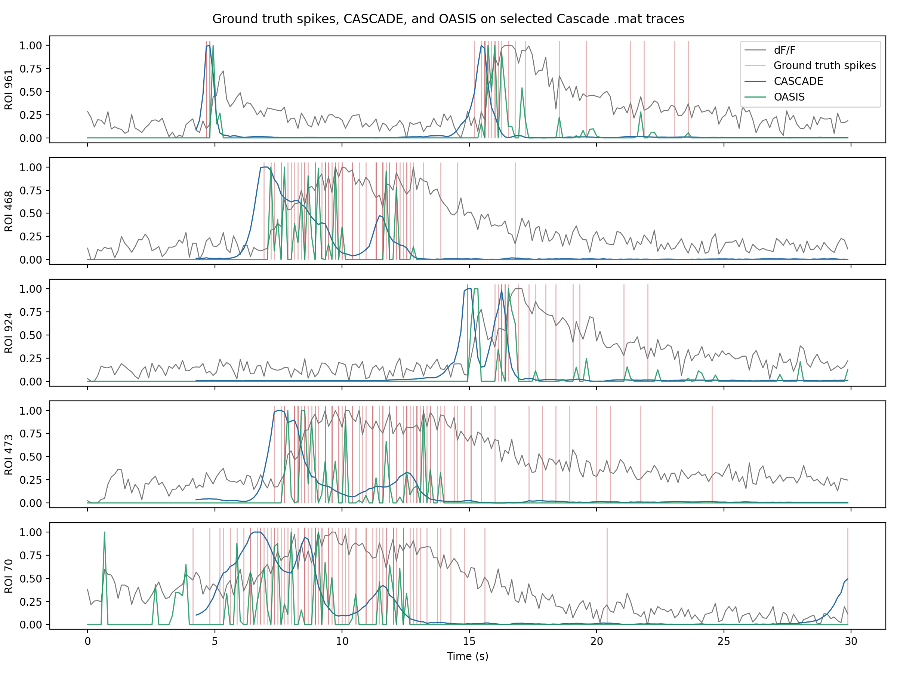

# Neural Spike Inference for Two-Photon Calcium Imaging

By: Arjun Phanse

## Overview

In this project, I built a neural spike inference pipeline for two-photon calcium imaging using four research software packages: [CIAtah](https://github.com/bahanonu/ciatah) [1], [Suite2p](https://github.com/MouseLand/suite2p) [2], [CascadeTorch](https://github.com/PTRRupprecht/CascadeTorch) [3], and [OASIS](https://github.com/j-friedrich/OASIS) [4]. The workflow starts from a two-photon calcium movie, identifies regions of interest (ROIs) corresponding to neurons, extracts the fluorescence traces for each region, converts them into $\Delta F/F$ traces, and finally passes them into CASCADE and OASIS for neural spike inference.

Although CASCADE and OASIS are both used for spike inference, they use fundamentally different approaches. CASCADE uses a convolutional neural network (CNN) that takes calcium fluorescence $\Delta F/F$ traces as input and predicts spike rates from patterns it learned from paired calcium-and-spike ground-truth datasets. OASIS is a deconvolution-based method that treats the trace as a filtered version of underlying spike activity and solves a constrained optimization problem to estimate the spike signal that best explains the observed fluorescence trace.

**References:**

[1] Corder, G., Ahanonu, B., Grewe, B. F., Wang, D., Schnitzer, M. J., Scherrer, G. 2019. [An amygdalar neural ensemble that encodes the unpleasantness of pain](http://science.sciencemag.org/content/363/6424/276.full). *Science*, 363(6424), 276-281.

[2] Pachitariu, M., Stringer, C., Dipoppa, M., Schröder, S., Rossi, L. F., Dalgleish, H., Carandini, M., Harris, K. D. 2017. [Suite2p: beyond 10,000 neurons with standard two-photon microscopy](https://www.biorxiv.org/content/10.1101/061507v2). *bioRxiv*.

[3] Rupprecht, P., Carta, S., Hoffmann, A., Echizen, M., Blot, A., Kwan, A. C., Dan, Y., Hofer, S. B., Kitamura, K., Helmchen, F., Friedrich, R. W. 2021. [A database and deep learning toolbox for noise-optimized, generalized spike inference from calcium imaging](https://www.nature.com/articles/s41593-021-00895-5). *Nature Neuroscience*, 24, 1324-1337.

[4] Friedrich, J., Zhou, P., Paninski, L. 2017. [Fast Online Deconvolution of Calcium Imaging Data](http://dx.doi.org/10.1371/journal.pcbi.1005423). *PLOS Computational Biology*, 13(3), e1005423.

## Demo


https://github.com/user-attachments/assets/94bf5f07-bdaf-4e33-8e1c-00d5dd3b3b61

The [video demo](videos/suite2p_cascade_oasis_realtime.mp4) visualizes one selected Suite2p ROI on the original two-photon movie and shows the raw $\Delta F/F$ trace beside the CASCADE and OASIS spike inference outputs.

## Approach

The project consists of two tracks:

1. A `Suite2p` track that starts from the CIAtah example two-photon movie, extracts ROIs using Suite2p, computes $\Delta F/F$ traces, and then runs CASCADE and OASIS on those traces.
2. A `CascadeTorch` example-data track that starts from one of the provided `.mat` files in CascadeTorch (already a $\Delta F/F$ trace) and compares CASCADE and OASIS against the ground-truth spike targets included with that example.

After Suite2p finds the ROIs and extracts their fluorescence traces, $\Delta F/F$ is computed. First, a fixed fraction of the neuropil trace is subtracted from the fluorescence trace to obtain the corrected trace $F$. Then, the pipeline estimates a per-neuron baseline fluorescence level using a low percentile over time and computes

$$
\Delta F/F = \frac{F - F_0}{|F_0|}
$$

where $F_0$ is the low-percentile baseline.

## Implementation

I organized the project as four notebooks. First, [run_suite2p.ipynb](run_suite2p.ipynb) runs Suite2p on the CIAtah movie and exports $\Delta F/F$ traces. Then, [run_cascade_oasis_suite2p.ipynb](run_cascade_oasis_suite2p.ipynb) runs CASCADE and OASIS on those traces. Similarly, [run_cascade_oasis_mat.ipynb](run_cascade_oasis_mat.ipynb) runs the same comparison on a CascadeTorch example `.mat` file with ground-truth spike targets. Lastly, [run_video_suite2p.ipynb](run_video_suite2p.ipynb) creates the synchronized calcium movie + trace demo video.

## Results

### Suite2p traces



This figure visualizes five traces corresponding to neurons extracted by Suite2p. The raw $\Delta F/F$ traces are plotted in gray, CASCADE is plotted in blue, and OASIS is plotted in green. In general, both methods respond strongly near the onset of the large calcium transients, suggesting that both are capturing the main spiking events in these traces.

### CascadeTorch `.mat` example



This figure depicts traces from a CascadeTorch example dataset with ground-truth spike targets, visualized by the red lines. This makes it easier to see whether predicted events occur near the labeled spikes. The alignment is not perfect, but both methods often rise around the same periods where ground-truth spikes are present. This figure also highlights the difficulty of burst inference when spikes occur very close together in time.

## Run

Here are the instructions to download the required libraries and data, and then run all the notebooks for this project.

```sh
# Clone Suite2p, CascadeTorch, OASIS, and CIAtah into libs/
sh clone_libs.sh

# Create and activate a Python 3.9 environment
conda create -n calcium-imaging python=3.9
conda activate calcium-imaging

# Install required Python packages
sh install.sh

# Download the CIAtah example two-photon movie
sh download_ciatah_2p_data.sh

# Run the notebooks in this order:
#  1. run_suite2p.ipynb
#  2. run_cascade_oasis_suite2p.ipynb
#  3. run_cascade_oasis_mat.ipynb
#  4. run_video_suite2p.ipynb
```

